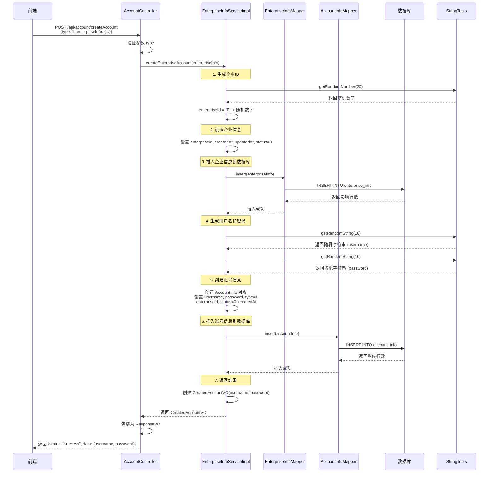
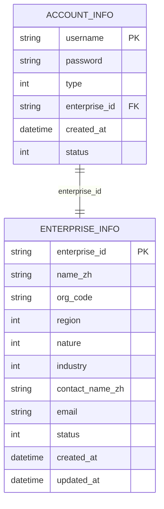
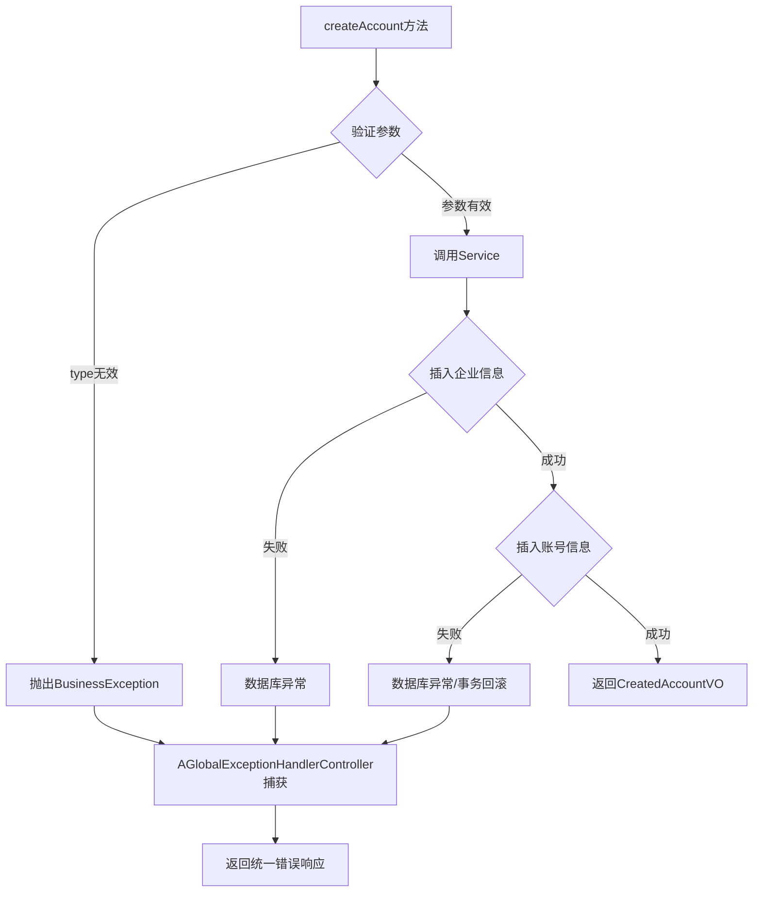

# 创建企业账号功能 - 类关系图

## 📋 功能概述

本文档专门描述"创建企业账号"功能的类关系设计，展示从API接口到数据库的完整调用链路。

---

## 🎯 功能流程

```
前端请求 → AccountController.createAccount() 
  → EnterpriseInfoService.createEnterpriseAccount()
    → EnterpriseInfoMapper.insert() (插入企业信息)
    → AccountInfoMapper.insert() (插入账号信息)
      → 返回 CreatedAccountVO (用户名和密码)
```

---

## 📊 核心类关系图

### 完整类关系图

```mermaid
classDiagram
    %% ========== Controller层 ==========
    class AccountController {
        -EnterpriseInfoService enterpriseInfoService
        +createAccount(CreateAccountDto) ResponseVO
    }
    
    class ABaseController {
        <<abstract>>
        +getSuccessResponseVO(T) ResponseVO
        +getErrorResponseVO(T) ResponseVO
    }
    
    %% ========== Service层 ==========
    class EnterpriseInfoService {
        <<interface>>
        +createEnterpriseAccount(EnterpriseInfo) CreatedAccountVO
    }
    
    class EnterpriseInfoServiceImpl {
        -EnterpriseInfoMapper enterpriseInfoMapper
        -AccountInfoMapper accountInfoMapper
        +createEnterpriseAccount(EnterpriseInfo) CreatedAccountVO
    }
    
    %% ========== Mapper层 ==========
    class BaseMapper {
        <<interface>>
        +insert(T) Integer
    }
    
    class EnterpriseInfoMapper {
        <<interface>>
        +insert(EnterpriseInfo) Integer
    }
    
    class AccountInfoMapper {
        <<interface>>
        +insert(AccountInfo) Integer
    }
    
    %% ========== Entity层 - DTO ==========
    class CreateAccountDto {
        -Integer type
        -EnterpriseInfo enterpriseInfo
        -Integer cityCode
        +getType() Integer
        +getEnterpriseInfo() EnterpriseInfo
        +getCityCode() Integer
    }
    
    %% ========== Entity层 - PO ==========
    class EnterpriseInfo {
        -String enterpriseId
        -String name
        -String orgCode
        -Integer region
        -Integer nature
        -Integer industry
        -String industryDesc
        -String contactName
        -String address
        -String postalCode
        -String phoneNum
        -String faxNum
        -String email
        -Integer status
        -Date createdAt
        -Date updatedAt
        +getters/setters
    }
    
    class AccountInfo {
        -String username
        -String password
        -Integer type
        -String enterpriseId
        -Integer cityCode
        -Date lastLoginTime
        -Integer status
        -Date createdAt
        +getters/setters
    }
    
    %% ========== Entity层 - VO ==========
    class CreatedAccountVO {
        -String username
        -String password
        +CreatedAccountVO(String username, String password)
        +getUsername() String
        +getPassword() String
    }
    
    class ResponseVO {
        -String status
        -Integer code
        -String info
        -T data
        +getters/setters
    }
    
    %% ========== Utils工具类 ==========
    class StringTools {
        <<utility>>
        +getRandomNumber(int length) String
        +getRandomString(int length) String
    }
    
    class Constants {
        <<final>>
        +String ENTERPRISE_ID_PREFIX = "E"
    }
    
    %% ========== Enums枚举 ==========
    class AccountTypeEnum {
        <<enumeration>>
        ENTERPRISE(1, "企业账号")
        CITY(2, "市级账号")
        PROVINCE(0, "省级账号")
        +getCode() Integer
    }
    
    class AccountStatusEnum {
        <<enumeration>>
        ENABLE(0, "启用")
        DISABLE(1, "禁用")
        +getCode() Integer
    }
    
    class EnterpriseStatusEnum {
        <<enumeration>>
        CREATED(0, "创建未备案")
        +getCode() Integer
    }
    
    class ResponseCodeEnum {
        <<enumeration>>
        CODE_200(200, "成功")
        CODE_600(600, "参数错误")
        +getCode() Integer
        +getMsg() String
    }
    
    %% ========== Exception ==========
    class BusinessException {
        -Integer code
        -String message
        +BusinessException(String message)
        +BusinessException(ResponseCodeEnum codeEnum)
    }
    
    %% ========== 关系定义 ==========
    
    %% 继承关系
    AccountController --|> ABaseController : extends
    
    %% 实现关系
    EnterpriseInfoServiceImpl ..|> EnterpriseInfoService : implements
    EnterpriseInfoMapper --|> BaseMapper : extends
    AccountInfoMapper --|> BaseMapper : extends
    
    %% 依赖关系 - Controller层
    AccountController --> EnterpriseInfoService : uses
    AccountController --> CreateAccountDto : receives
    AccountController --> ResponseVO : returns
    AccountController --> BusinessException : throws
    
    %% 依赖关系 - Service层
    EnterpriseInfoServiceImpl --> EnterpriseInfoMapper : uses
    EnterpriseInfoServiceImpl --> AccountInfoMapper : uses
    EnterpriseInfoServiceImpl --> EnterpriseInfo : creates
    EnterpriseInfoServiceImpl --> AccountInfo : creates
    EnterpriseInfoServiceImpl --> CreatedAccountVO : returns
    EnterpriseInfoServiceImpl --> StringTools : uses
    EnterpriseInfoServiceImpl --> Constants : uses
    EnterpriseInfoServiceImpl --> AccountTypeEnum : uses
    EnterpriseInfoServiceImpl --> AccountStatusEnum : uses
    EnterpriseInfoServiceImpl --> EnterpriseStatusEnum : uses
    
    %% 依赖关系 - Mapper层
    EnterpriseInfoMapper --> EnterpriseInfo : maps to
    AccountInfoMapper --> AccountInfo : maps to
    
    %% 依赖关系 - Entity层
    CreateAccountDto --> EnterpriseInfo : contains
    AccountInfo --> EnterpriseInfo : references (via enterpriseId)
    
    %% 依赖关系 - 其他
    AccountController --> ResponseCodeEnum : uses
```



---

## 🔄 方法调用序列图



---

## 📦 核心类详细说明

### 1. Controller层

#### AccountController

**职责**：接收HTTP请求，调用Service层处理业务逻辑

**关键方法**：
```java
@PostMapping("/createAccount")
public ResponseVO createAccount(@RequestBody CreateAccountDto createAccountDto) 
    throws BusinessException
```

**处理流程**：
1. 接收 `CreateAccountDto` 参数
2. 验证账号类型（必须是企业账号或市账号）
3. 根据类型调用对应的Service方法
4. 返回统一格式的响应

**依赖**：
- `EnterpriseInfoService` - 企业信息服务

---

### 2. Service层

#### EnterpriseInfoServiceImpl.createEnterpriseAccount()

**职责**：封装创建企业账号的完整业务逻辑

**方法签名**：
```java
public CreatedAccountVO createEnterpriseAccount(EnterpriseInfo enterpriseInfo)
```

**核心流程**：

| 步骤 | 操作 | 说明 |
| :--- | :--- | :--- |
| 1 | 生成企业ID | `E` + 20位随机数字 |
| 2 | 设置企业信息初始值 | enterpriseId, createdAt, updatedAt, status=0 |
| 3 | 插入企业信息 | 调用 `enterpriseInfoMapper.insert()` |
| 4 | 生成用户名 | 10位随机字符串 |
| 5 | 生成密码 | 10位随机字符串 |
| 6 | 创建账号对象 | 设置username, password, type=1, enterpriseId, status=0 |
| 7 | 插入账号信息 | 调用 `accountInfoMapper.insert()` |
| 8 | 返回结果 | 返回 `CreatedAccountVO(username, password)` |

**依赖**：
- `EnterpriseInfoMapper` - 企业信息数据访问
- `AccountInfoMapper` - 账号信息数据访问
- `StringTools` - 随机字符串生成工具
- `Constants` - 常量定义

---

### 3. Mapper层

#### EnterpriseInfoMapper.insert()

**职责**：将企业信息插入到数据库

**SQL映射**：
- XML文件：`EnterpriseInfoMapper.xml`
- 映射表：`enterprise_info`
- 关键字段映射：`name` → `name_zh`, `contactName` → `contact_name_zh`

#### AccountInfoMapper.insert()

**职责**：将账号信息插入到数据库

**SQL映射**：
- XML文件：`AccountInfoMapper.xml`
- 映射表：`account_info`
- 关联字段：`enterprise_id` 关联 `enterprise_info.enterprise_id`

---

### 4. Entity层

#### CreateAccountDto

**用途**：接收前端请求参数

**字段**：
- `type` - 账号类型（1=企业账号，2=市账号）
- `enterpriseInfo` - 企业信息对象（type=1时必填）
- `cityCode` - 市编码（type=2时必填）

#### EnterpriseInfo (PO)

**用途**：企业信息持久化对象

**关键字段**：
- `enterpriseId` - 企业ID（主键，格式：E + 20位数字）
- `name` - 企业名称（映射到数据库 `name_zh`）
- `status` - 企业状态（0=创建未备案）

#### AccountInfo (PO)

**用途**：账号信息持久化对象

**关键字段**：
- `username` - 用户名（主键，10位随机字符串）
- `password` - 密码（10位随机字符串）
- `type` - 账号类型（1=企业账号）
- `enterpriseId` - 企业ID（外键，关联enterprise_info）

#### CreatedAccountVO

**用途**：返回创建账号的结果

**字段**：
- `username` - 生成的用户名
- `password` - 生成的密码

**构造函数**：
```java
public CreatedAccountVO(String username, String password)
```

---

### 5. 工具类和常量

#### StringTools

**工具方法**：
- `getRandomNumber(int length)` - 生成指定长度的随机数字字符串
- `getRandomString(int length)` - 生成指定长度的随机字符串（字母+数字）

#### Constants

**常量**：
- `ENTERPRISE_ID_PREFIX = "E"` - 企业ID前缀

---

### 6. 枚举类

#### AccountTypeEnum

**值**：
- `ENTERPRISE(1, "企业账号")` - 企业账号类型
- `CITY(2, "市级账号")` - 市级账号类型

#### AccountStatusEnum

**值**：
- `ENABLE(0, "启用")` - 账号启用状态
- `DISABLE(1, "禁用")` - 账号禁用状态

#### EnterpriseStatusEnum

**值**：
- `CREATED(0, "创建未备案")` - 企业创建未备案状态

---

## 🗄️ 数据库表关系

### ER关系图



**关系说明**：
- `account_info.enterprise_id` → `enterprise_info.enterprise_id`
- 一个企业账号对应一个企业信息（一对一关系）
- 创建账号时，先创建企业信息，再创建账号信息

---

## 📝 关键算法

### 1. 企业ID生成算法

```java
String enterpriseId = Constants.ENTERPRISE_ID_PREFIX + StringTools.getRandomNumber(20);
```

**格式**：`E` + 20位随机数字  
**示例**：`E48260021273246716765`

### 2. 用户名生成算法

```java
String username = StringTools.getRandomString(10);
```

**格式**：10位随机字符串（字母+数字）  
**示例**：`RInQF54wd5`

### 3. 密码生成算法

```java
String password = StringTools.getRandomString(10);
```

**格式**：10位随机字符串（字母+数字）  
**示例**：`O8tlZlHzXS`

---

## 🔄 数据流转过程

```
┌─────────────────────────────────────────────────────────────┐
│                    1. 接收请求                               │
│  CreateAccountDto {                                           │
│    type: 1,                                                   │
│    enterpriseInfo: {                                          │
│      name: "测试企业",                                        │
│      region: 530100,                                          │
│      nature: 1,                                               │
│      industry: 1,                                             │
│      contactName: "张三",                                      │
│      email: "test@example.com"                                │
│    }                                                          │
│  }                                                            │
└──────────────────────────┬──────────────────────────────────┘
                           ↓
┌─────────────────────────────────────────────────────────────┐
│                    2. 生成企业ID                              │
│  enterpriseId = "E" + getRandomNumber(20)                   │
│  结果: "E48260021273246716765"                               │
└──────────────────────────┬──────────────────────────────────┘
                           ↓
┌─────────────────────────────────────────────────────────────┐
│                    3. 插入企业信息                            │
│  EnterpriseInfo {                                             │
│    enterpriseId: "E48260021273246716765",                    │
│    name: "测试企业",                                          │
│    status: 0,                                                 │
│    createdAt: 2025-11-03 10:00:00,                           │
│    updatedAt: 2025-11-03 10:00:00                            │
│  }                                                            │
│  → INSERT INTO enterprise_info ...                            │
└──────────────────────────┬──────────────────────────────────┘
                           ↓
┌─────────────────────────────────────────────────────────────┐
│                    4. 生成账号凭证                            │
│  username = getRandomString(10)  → "RInQF54wd5"            │
│  password = getRandomString(10)  → "O8tlZlHzXS"           │
└──────────────────────────┬──────────────────────────────────┘
                           ↓
┌─────────────────────────────────────────────────────────────┐
│                    5. 插入账号信息                            │
│  AccountInfo {                                                │
│    username: "RInQF54wd5",                                   │
│    password: "O8tlZlHzXS",                                   │
│    type: 1,                                                   │
│    enterpriseId: "E48260021273246716765",                   │
│    status: 0,                                                 │
│    createdAt: 2025-11-03 10:00:00                            │
│  }                                                            │
│  → INSERT INTO account_info ...                               │
└──────────────────────────┬──────────────────────────────────┘
                           ↓
┌─────────────────────────────────────────────────────────────┐
│                    6. 返回结果                                │
│  CreatedAccountVO {                                           │
│    username: "RInQF54wd5",                                   │
│    password: "O8tlZlHzXS"                                     │
│  }                                                            │
│  → ResponseVO { status: "success", data: {...} }            │
└─────────────────────────────────────────────────────────────┘
```

---

## ⚠️ 异常处理

### 可能的异常

1. **参数验证异常**
   ```java
   if (type != 1 && type != 2) {
       throw new BusinessException(ResponseCodeEnum.CODE_600);
   }
   ```

2. **数据库插入异常**
   - 企业ID重复（主键冲突）
   - 用户名重复（主键冲突）
   - 数据库连接失败

### 异常处理机制



---

## 📊 设计模式应用

### 1. 分层架构模式
- **Controller层**：处理HTTP请求
- **Service层**：业务逻辑处理
- **Mapper层**：数据访问

### 2. 依赖注入模式
- 使用 `@Resource` 注入依赖
- Controller依赖Service，Service依赖Mapper

### 3. 工厂模式（隐含）
- `StringTools` 用于生成随机字符串，类似工厂模式

### 4. 数据传输对象模式
- **DTO**：`CreateAccountDto` - 接收请求
- **VO**：`CreatedAccountVO` - 返回响应
- **PO**：`EnterpriseInfo`, `AccountInfo` - 持久化对象

---

## 📋 方法签名汇总

### Controller层

```java
@PostMapping("/createAccount")
public ResponseVO createAccount(@RequestBody CreateAccountDto createAccountDto) 
    throws BusinessException
```

### Service层

```java
CreatedAccountVO createEnterpriseAccount(EnterpriseInfo enterpriseInfo)
```

### Mapper层

```java
// EnterpriseInfoMapper
Integer insert(@Param("bean") EnterpriseInfo bean);

// AccountInfoMapper
Integer insert(@Param("bean") AccountInfo bean);
```

---

## ✅ 总结

### 关键类

1. **AccountController** - 入口控制器
2. **EnterpriseInfoServiceImpl** - 核心业务逻辑
3. **EnterpriseInfoMapper** - 企业信息数据访问
4. **AccountInfoMapper** - 账号信息数据访问

### 关键实体

1. **CreateAccountDto** - 请求参数
2. **EnterpriseInfo** - 企业信息实体
3. **AccountInfo** - 账号信息实体
4. **CreatedAccountVO** - 返回结果

### 调用链路

```
AccountController.createAccount()
  ↓
EnterpriseInfoServiceImpl.createEnterpriseAccount()
  ↓
EnterpriseInfoMapper.insert() + AccountInfoMapper.insert()
  ↓
数据库 (enterprise_info + account_info)
```

---

**文档版本**：v1.0  
**最后更新**：2025-11-03  
**维护人员**：系统开发团队

