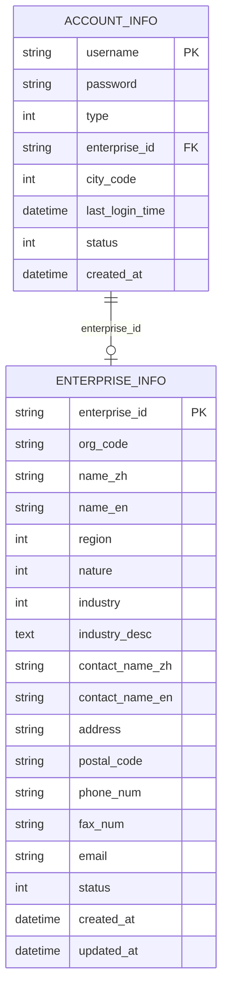

# 账号管理系统设计文档

## 一、系统概述

### 1.1 功能简介

账号管理系统是云南省企业就业失业数据采集系统的核心模块之一，主要负责：
- 企业账号的创建和管理
- 企业账号的查询和状态管理
- 企业信息与账号信息的关联管理
- 省级管理员的身份认证和权限控制

### 1.2 技术栈

- **后端框架**：Spring Boot 3.5.6
- **ORM框架**：MyBatis 3
- **数据库**：MySQL 8.0
- **缓存**：Redis（用于Token存储）
- **依赖注入**：Spring IoC
- **Java版本**：JDK 17

---

## 二、系统架构

### 2.1 分层架构

系统采用经典的三层架构模式：

```
┌─────────────────────────────────────────┐
│          Controller Layer               │  (表现层)
│      AccountController                   │
│  - 接收HTTP请求                          │
│  - 参数验证                              │
│  - 调用Service层                          │
│  - 返回统一响应格式                      │
└─────────────────────────────────────────┘
                    ↓
┌─────────────────────────────────────────┐
│          Service Layer                  │  (业务层)
│  ┌─────────────────────┐              │
│  │EnterpriseInfoService │              │
│  │- createEnterpriseAccount()          │
│  │- createCityAccount()                │
│  └─────────────────────┘              │
│  ┌─────────────────────┐              │
│  │AccountInfoService   │              │
│  │- findListByPageWithAssociated()    │
│  │- updateAccountInfoByUsername()     │
│  └─────────────────────┘              │
└─────────────────────────────────────────┘
                    ↓
┌─────────────────────────────────────────┐
│          Mapper Layer                   │  (数据访问层)
│  ┌─────────────────────┐              │
│  │EnterpriseInfoMapper  │              │
│  │- insert()                           │
│  │- selectByEnterpriseId()             │
│  └─────────────────────┘              │
│  ┌─────────────────────┐              │
│  │AccountInfoMapper    │              │
│  │- insert()                           │
│  │- findListByParamWithAssociated()    │
│  └─────────────────────┘              │
└─────────────────────────────────────────┘
                    ↓
┌─────────────────────────────────────────┐
│          Database Layer                │  (数据库层)
│  MySQL Database                         │
│  - enterprise_info                      │
│  - account_info                         │
└─────────────────────────────────────────┘
```

### 2.2 模块划分

系统采用Maven多模块架构：

```
yunnan-employment-data-collection-system
├── yunnan-common (公共模块)
│   ├── entity (实体类)
│   │   ├── po (持久化对象)
│   │   ├── vo (视图对象)
│   │   ├── dto (数据传输对象)
│   │   └── query (查询对象)
│   ├── mapper (数据访问接口)
│   ├── service (业务接口和实现)
│   ├── component (组件)
│   └── utils (工具类)
│
└── yunnan-province (省级管理模块)
    ├── controller (控制器)
    ├── config (配置类)
    └── resources (资源配置)
```

---

## 三、类关系图

### 3.1 核心类关系图

```mermaid
classDiagram
    %% Controller层
    class AccountController {
        -AppConfig appconfig
        -RedisComponent redisComponent
        -EnterpriseInfoService enterpriseInfoService
        -AccountInfoService accountInfoService
        +login(LoginDto) ResponseVO
        +logout() ResponseVO
        +createAccount(CreateAccountDto) ResponseVO
        +loadAllEnterpriseAccount(AccountInfoQuery) ResponseVO
        +changeStatus(ChangeStatusDto) ResponseVO
    }
    
    class ABaseController {
        #RedisComponent redisComponent
        +getSuccessResponseVO(T) ResponseVO
        +getErrorResponseVO(T) ResponseVO
        +saveToken2Cookie(String)
        +cleanToken(AccountTypeEnum)
        +getTokenFromCookie() String
    }
    
    %% Service层
    class EnterpriseInfoService {
        <<interface>>
        +createEnterpriseAccount(EnterpriseInfo) CreatedAccountVO
        +createCityAccount(Integer) CreatedAccountVO
        +findListByParam(EnterpriseInfoQuery) List~EnterpriseInfo~
        +findCountByParam(EnterpriseInfoQuery) Integer
        +findListByPage(EnterpriseInfoQuery) PaginationResultVO
        +add(EnterpriseInfo) Integer
        +getEnterpriseInfoByEnterpriseId(String) EnterpriseInfo
        +updateEnterpriseInfoByEnterpriseId(EnterpriseInfo, String) Integer
        +deleteEnterpriseInfoByEnterpriseId(String) Integer
    }
    
    class EnterpriseInfoServiceImpl {
        -EnterpriseInfoMapper enterpriseInfoMapper
        -AccountInfoMapper accountInfoMapper
        +createEnterpriseAccount(EnterpriseInfo) CreatedAccountVO
        +createCityAccount(Integer) CreatedAccountVO
        +findListByParam(EnterpriseInfoQuery) List~EnterpriseInfo~
        +findCountByParam(EnterpriseInfoQuery) Integer
        +findListByPage(EnterpriseInfoQuery) PaginationResultVO
        +add(EnterpriseInfo) Integer
        +getEnterpriseInfoByEnterpriseId(String) EnterpriseInfo
        +updateEnterpriseInfoByEnterpriseId(EnterpriseInfo, String) Integer
        +deleteEnterpriseInfoByEnterpriseId(String) Integer
    }
    
    class AccountInfoService {
        <<interface>>
        +findListByParam(AccountInfoQuery) List~AccountInfo~
        +findCountByParam(AccountInfoQuery) Integer
        +findListByPage(AccountInfoQuery) PaginationResultVO
        +findListByPageWithAssociated(AccountInfoQuery) PaginationResultVO
        +add(AccountInfo) Integer
        +getAccountInfoByUsername(String) AccountInfo
        +updateAccountInfoByUsername(AccountInfo, String) Integer
        +deleteAccountInfoByUsername(String) Integer
        +login(String, String) TokenInfoVO
    }
    
    class AccountInfoServiceImpl {
        -AccountInfoMapper accountInfoMapper
        -EnterpriseInfoMapper enterpriseInfoMapper
        -RedisComponent redisComponent
        +findListByParam(AccountInfoQuery) List~AccountInfo~
        +findCountByParam(AccountInfoQuery) Integer
        +findListByPage(AccountInfoQuery) PaginationResultVO
        +findListByPageWithAssociated(AccountInfoQuery) PaginationResultVO
        +add(AccountInfo) Integer
        +getAccountInfoByUsername(String) AccountInfo
        +updateAccountInfoByUsername(AccountInfo, String) Integer
        +deleteAccountInfoByUsername(String) Integer
        +login(String, String) TokenInfoVO
    }
    
    %% Mapper层
    class BaseMapper {
        <<interface>>
        +insert(T) Integer
        +insertOrUpdate(T) Integer
        +insertBatch(List~T~) Integer
        +insertOrUpdateBatch(List~T~) Integer
        +selectList(P) List~T~
        +selectCount(P) Integer
    }
    
    class EnterpriseInfoMapper {
        <<interface>>
        +selectByEnterpriseId(String) EnterpriseInfo
        +updateByEnterpriseId(EnterpriseInfo, String) Integer
        +deleteByEnterpriseId(String) Integer
    }
    
    class AccountInfoMapper {
        <<interface>>
        +selectByUsername(String) AccountInfo
        +updateByUsername(AccountInfo, String) Integer
        +deleteByUsername(String) Integer
        +findListByParamWithAssociatedEnterpriseInfo(AccountInfoQuery) List~AccountEnterpriseVO~
    }
    
    %% Entity层
    class EnterpriseInfo {
        -String enterpriseId
        -String orgCode
        -String name
        -Integer region
        -Integer nature
        -Integer industry
        -String industryDesc
        -String contactName
        -String address
        -String postalCode
        -String phoneNum
        -String faxNum
        -String email
        -Integer status
        -Date createdAt
        -Date updatedAt
        +getters/setters
    }
    
    class AccountInfo {
        -String username
        -String password
        -Integer type
        -String enterpriseId
        -Integer cityCode
        -Date lastLoginTime
        -Integer status
        -Date createdAt
        +getters/setters
    }
    
    class CreateAccountDto {
        -Integer type
        -EnterpriseInfo enterpriseInfo
        -Integer cityCode
        +getters/setters
    }
    
    class CreatedAccountVO {
        -String username
        -String password
        +CreatedAccountVO(String, String)
    }
    
    class AccountEnterpriseVO {
        -String username
        -String password
        -Integer type
        -String enterpriseId
        -Integer cityCode
        -Date lastLoginTime
        -Integer status
        -Date createdAt
        -String name
        -String orgCode
        -Integer region
        -Integer nature
        -Integer industry
        -String industryDesc
        -String contactName
        -String address
        -String postalCode
        -String phoneNum
        -String faxNum
        -String email
        +getters/setters
    }
    
    class AccountInfoQuery {
        -String username
        -String usernameFuzzy
        -String enterpriseId
        -String enterpriseIdFuzzy
        -Integer type
        -Integer status
        -Integer pageNo
        -Integer pageSize
        +getters/setters
    }
    
    class ResponseVO {
        -String status
        -Integer code
        -String info
        -T data
        +getters/setters
    }
    
    %% Component层
    class RedisComponent {
        -RedisUtils redisUtils
        +saveEnterpriseTokenInfo(TokenInfoVO)
        +getEnterpriseTokenInfo(String) TokenInfoVO
        +cleanEnterpriseTokenInfo(String)
        +saveProvinceTokenInfo(String)
        +cleanProvinceTokenInfo(String)
        +cleanCityTokenInfo(String)
    }
    
    %% 关系定义
    AccountController --|> ABaseController : extends
    AccountController --> EnterpriseInfoService : uses
    AccountController --> AccountInfoService : uses
    AccountController --> RedisComponent : uses
    
    EnterpriseInfoServiceImpl ..|> EnterpriseInfoService : implements
    EnterpriseInfoServiceImpl --> EnterpriseInfoMapper : uses
    EnterpriseInfoServiceImpl --> AccountInfoMapper : uses
    
    AccountInfoServiceImpl ..|> AccountInfoService : implements
    AccountInfoServiceImpl --> AccountInfoMapper : uses
    AccountInfoServiceImpl --> EnterpriseInfoMapper : uses
    AccountInfoServiceImpl --> RedisComponent : uses
    
    EnterpriseInfoMapper --|> BaseMapper : extends
    AccountInfoMapper --|> BaseMapper : extends
    
    AccountController --> CreateAccountDto : uses
    AccountController --> CreatedAccountVO : returns
    AccountController --> AccountInfoQuery : uses
    AccountController --> ResponseVO : returns
    
    EnterpriseInfoService --> EnterpriseInfo : uses
    EnterpriseInfoService --> CreatedAccountVO : returns
    EnterpriseInfoService --> AccountInfo : creates
    
    AccountInfoService --> AccountInfo : uses
    AccountInfoService --> AccountEnterpriseVO : returns
    AccountInfoService --> AccountInfoQuery : uses
    
    AccountInfoMapper --> AccountInfo : maps to
    AccountInfoMapper --> AccountEnterpriseVO : returns
    EnterpriseInfoMapper --> EnterpriseInfo : maps to
    
    AccountInfo --> EnterpriseInfo : references (via enterpriseId)
```



### 3.2 数据实体关系图



---

## 四、核心类设计

### 4.1 Controller层

#### AccountController

**职责**：
- 接收HTTP请求
- 参数验证和转换
- 调用Service层业务逻辑
- 返回统一格式的响应

**关键方法**：

| 方法名 | HTTP方法 | 路径 | 功能 |
| :----- | :------- | :--- | :--- |
| `createAccount` | POST | `/api/account/createAccount` | 创建企业账号 |
| `loadAllEnterpriseAccount` | GET | `/api/account/loadAllEnterpriseAccount` | 查询企业账号列表 |
| `changeStatus` | POST | `/api/account/changeStatus` | 修改账号状态 |

**依赖注入**：
- `EnterpriseInfoService`：企业信息服务
- `AccountInfoService`：账号信息服务
- `RedisComponent`：Redis组件（Token管理）

### 4.2 Service层

#### EnterpriseInfoService / EnterpriseInfoServiceImpl

**职责**：
- 封装企业信息相关的业务逻辑
- 实现企业账号创建流程
- 管理企业信息CRUD操作

**核心方法**：

```java
/**
 * 创建企业账号
 * 1. 生成企业ID（E + 20位随机数字）
 * 2. 创建企业信息记录
 * 3. 生成用户名和密码（各10位随机字符串）
 * 4. 创建账号记录
 * 5. 返回用户名和密码
 */
CreatedAccountVO createEnterpriseAccount(EnterpriseInfo enterpriseInfo)
```

**业务流程**：
```
1. 生成企业ID → 2. 设置企业信息初始值 → 3. 插入enterprise_info表
4. 生成用户名 → 5. 生成密码 → 6. 创建AccountInfo对象
7. 插入account_info表 → 8. 返回CreatedAccountVO
```

#### AccountInfoService / AccountInfoServiceImpl

**职责**：
- 封装账号信息相关的业务逻辑
- 实现账号查询和管理功能
- 提供关联查询（账号+企业信息）

**核心方法**：

```java
/**
 * 分页查询企业账号列表（关联企业信息）
 * 使用LEFT JOIN关联enterprise_info表
 * 支持字段映射：name_zh/name_en → name
 */
PaginationResultVO<AccountEnterpriseVO> findListByPageWithAssociated(AccountInfoQuery query)
```

### 4.3 Mapper层

#### BaseMapper<T, P>

**职责**：
- 定义通用的数据访问方法
- 提供CRUD基础操作

**泛型说明**：
- `T`：实体类型（Entity）
- `P`：查询类型（Query）

#### EnterpriseInfoMapper

**职责**：
- 企业信息表的数据访问
- 提供基于enterprise_id的查询、更新、删除

**关键SQL映射**：
- `insert`：插入企业信息，name字段映射到name_zh
- `selectByEnterpriseId`：根据企业ID查询
- `selectList`：使用COALESCE映射name_zh/name_en到name

#### AccountInfoMapper

**职责**：
- 账号信息表的数据访问
- 提供关联查询（账号+企业信息）

**关键SQL映射**：
- `findListByParamWithAssociatedEnterpriseInfo`：关联查询账号和企业信息
- `selectByUsername`：根据用户名查询账号

### 4.4 Entity层

#### EnterpriseInfo (PO)

**对应数据库表**：`enterprise_info`

**关键字段**：
- `enterpriseId`：企业ID（主键，格式：E + 20位数字）
- `name`：企业名称（映射到数据库的`name_zh`字段）
- `contactName`：联系人名称（映射到数据库的`contact_name_zh`字段）
- `status`：企业状态（0-创建未备案，1-已备案未审核，2-已退回，3-正常，4-倒闭）

#### AccountInfo (PO)

**对应数据库表**：`account_info`

**关键字段**：
- `username`：用户名（主键，10位随机字符串）
- `password`：密码（10位随机字符串，明文存储）
- `type`：账号类型（1-企业账号，2-市账号）
- `enterpriseId`：企业ID（外键，关联enterprise_info表）
- `status`：账号状态（0-正常，1-停用）

#### AccountEnterpriseVO (VO)

**职责**：
- 用于返回账号信息和企业信息的组合数据
- 包含账号基本信息和关联的企业详细信息

**字段来源**：
- 账号信息字段：来自`account_info`表
- 企业信息字段：来自`enterprise_info`表（通过LEFT JOIN）

#### CreateAccountDto (DTO)

**职责**：
- 接收创建账号的请求参数
- 封装企业信息和账号类型

**字段**：
- `type`：账号类型（1-企业账号，2-市账号）
- `enterpriseInfo`：企业信息对象（type=1时必填）
- `cityCode`：市编码（type=2时必填）

#### CreatedAccountVO (VO)

**职责**：
- 返回创建账号后的结果
- 包含系统生成的用户名和密码

**字段**：
- `username`：生成的用户名
- `password`：生成的密码

---

## 五、设计模式

### 5.1 分层架构模式（Layered Architecture）

系统采用经典的三层架构：
- **Controller层**：处理HTTP请求和响应
- **Service层**：业务逻辑处理
- **Mapper层**：数据访问

### 5.2 依赖注入模式（Dependency Injection）

使用Spring的`@Resource`注解实现依赖注入：
- Controller依赖Service
- Service依赖Mapper
- Service依赖Component

### 5.3 模板方法模式（Template Method）

`ABaseController`作为基类，提供通用的方法：
- `getSuccessResponseVO()`：统一成功响应格式
- `getErrorResponseVO()`：统一错误响应格式
- `saveToken2Cookie()`：Token保存到Cookie
- `cleanToken()`：清理Token

### 5.4 策略模式（Strategy）

通过枚举类实现策略模式：
- `AccountTypeEnum`：账号类型策略（企业/市）
- `AccountStatusEnum`：账号状态策略（正常/停用）
- `EnterpriseStatusEnum`：企业状态策略（创建未备案/已备案未审核/正常等）

### 5.5 数据传输对象模式（DTO Pattern）

使用DTO、VO、Query对象分离不同层的数据传输：
- **DTO**：Controller接收的请求数据（CreateAccountDto）
- **VO**：Controller返回的响应数据（CreatedAccountVO、AccountEnterpriseVO）
- **Query**：查询参数对象（AccountInfoQuery）
- **PO**：持久化对象（AccountInfo、EnterpriseInfo）

---

## 六、数据流设计

### 6.1 创建企业账号数据流

```
┌─────────────┐
│  Frontend   │
│  前端页面    │
└──────┬──────┘
       │ HTTP POST /api/account/createAccount
       │ { type: 1, enterpriseInfo: {...} }
       ↓
┌──────────────────────┐
│  AccountController    │
│  createAccount()      │
└──────┬───────────────┘
       │ 验证参数
       │ 调用 Service
       ↓
┌──────────────────────────┐
│ EnterpriseInfoServiceImpl │
│ createEnterpriseAccount()│
└──────┬───────────────────┘
       │ 1. 生成企业ID
       │ 2. 设置企业信息初始值
       │ 调用 Mapper
       ↓
┌─────────────────────┐      ┌──────────────────────┐
│EnterpriseInfoMapper │      │  AccountInfoMapper   │
│   insert()          │      │    insert()           │
└──────┬──────────────┘      └──────┬───────────────┘
       │                            │
       ↓                            ↓
┌──────────────────┐         ┌──────────────────┐
│  enterprise_info  │         │   account_info    │
│      表           │         │       表          │
└──────────────────┘         └──────────────────┘
       │                            │
       └──────────────┬─────────────┘
                      ↓
            ┌─────────────────────┐
            │  CreatedAccountVO   │
            │ {username, password}│
            └──────────┬──────────┘
                       ↓
            ┌─────────────────────┐
            │   ResponseVO        │
            │ 返回给前端           │
            └─────────────────────┘
```

### 6.2 查询企业账号列表数据流

```
┌─────────────┐
│  Frontend   │
│  前端页面    │
└──────┬──────┘
       │ HTTP GET /api/account/loadAllEnterpriseAccount?pageNo=1&pageSize=10
       ↓
┌──────────────────────┐
│  AccountController    │
│loadAllEnterpriseAccount│
└──────┬───────────────┘
       │ 设置查询条件 type=1
       │ 调用 Service
       ↓
┌──────────────────────────┐
│ AccountInfoServiceImpl    │
│findListByPageWithAssociated│
└──────┬───────────────────┘
       │ 调用 Mapper
       ↓
┌──────────────────────────┐
│   AccountInfoMapper      │
│findListByParamWithAssociated│
│      EnterpriseInfo      │
│  (SQL: LEFT JOIN)        │
└──────┬───────────────────┘
       │ 执行SQL查询
       ↓
┌──────────────────────────────────────┐
│  SELECT a.*, e.* FROM account_info a │
│  LEFT JOIN enterprise_info e        │
│  ON a.enterprise_id = e.enterprise_id│
│  WHERE a.type = 1                    │
└──────┬───────────────────────────────┘
       │ 结果映射到 AccountEnterpriseVO
       ↓
┌──────────────────────────┐
│  PaginationResultVO       │
│  {list, pageNo, pageSize, │
│   pageTotal, totalCount}  │
└──────┬───────────────────┘
       ↓
┌─────────────────────┐
│   ResponseVO        │
│ 返回给前端           │
└─────────────────────┘
```

---

## 七、数据库设计

### 7.1 表结构关系

#### enterprise_info 表

| 字段名 | 类型 | 说明 | 约束 |
| :----- | :--- | :--- | :--- |
| enterprise_id | VARCHAR(50) | 企业ID | PRIMARY KEY |
| org_code | VARCHAR(255) | 组织机构代码 | |
| name_zh | VARCHAR(255) | 企业名称中文 | |
| name_en | VARCHAR(255) | 企业名称英文 | |
| region | INT | 所属地区编码 | |
| nature | INT | 所属性质编码 | |
| industry | INT | 所属行业编码 | |
| industry_desc | TEXT | 主要经营业务详情 | |
| contact_name_zh | VARCHAR(50) | 联系人中文名 | |
| contact_name_en | VARCHAR(50) | 联系人英文名 | |
| address | VARCHAR(500) | 联系人地址 | |
| postal_code | VARCHAR(10) | 邮政编码 | |
| phone_num | VARCHAR(20) | 联系电话 | |
| fax_num | VARCHAR(20) | 传真号 | |
| email | VARCHAR(100) | 电子邮箱 | |
| status | INT | 企业状态 | |
| created_at | DATETIME | 创建时间 | |
| updated_at | DATETIME | 更新时间 | |

#### account_info 表

| 字段名 | 类型 | 说明 | 约束 |
| :----- | :--- | :--- | :--- |
| username | VARCHAR(50) | 用户名 | PRIMARY KEY |
| password | VARCHAR(100) | 密码 | |
| type | INT | 账号类型（1-企业，2-市） | |
| enterprise_id | VARCHAR(50) | 企业ID | FOREIGN KEY → enterprise_info.enterprise_id |
| city_code | INT | 市编码 | |
| last_login_time | DATETIME | 最后登录时间 | |
| status | INT | 账号状态（0-正常，1-停用） | |
| created_at | DATETIME | 创建时间 | |

### 7.2 关系说明

- **一对一双向关系**：一个企业只能有一个账号，一个账号只能关联一个企业
- **关联字段**：`account_info.enterprise_id` → `enterprise_info.enterprise_id`
- **查询方式**：使用`LEFT JOIN`关联查询，即使企业信息为空也能返回账号信息

---

## 八、核心算法设计

### 8.1 企业ID生成算法

```java
/**
 * 生成企业ID
 * 格式：E + 20位随机数字
 * 示例：E48260021273246716765
 */
String enterpriseId = Constants.ENTERPRISE_ID_PREFIX + StringTools.getRandomNumber(20);
```

**特点**：
- 前缀固定：`E`
- 长度固定：21位（E + 20位数字）
- 唯一性：通过数据库主键约束保证

### 8.2 用户名和密码生成算法

```java
/**
 * 生成用户名和密码
 * 长度：10位字符
 * 字符集：大小写字母 + 数字（密码可能包含特殊字符）
 * 示例：RInQF54wd5, O8tlZlHzXS
 */
String username = StringTools.getRandomString(10);
String password = StringTools.getRandomString(10);
```

**特点**：
- 长度固定：10位
- 随机生成：使用随机字符串算法
- 唯一性：通过数据库主键约束保证

### 8.3 字段映射算法

```sql
-- 企业名称映射：优先显示中文，如果没有则显示英文
COALESCE(e.name_zh, e.name_en, '') as name

-- 联系人名称映射：优先显示中文，如果没有则显示英文
COALESCE(e.contact_name_zh, e.contact_name_en, '') as contact_name
```

**特点**：
- 兼容中英文双语
- 优先显示中文
- 如果都没有则返回空字符串

---

## 九、异常处理设计

### 9.1 异常层次结构

```
Exception
  └── BusinessException (业务异常)
       ├── 账号类型参数错误 (错误码600)
       ├── 企业名称不能为空 (错误码603)
       └── 账号或密码错误
```

### 9.2 统一异常处理

系统使用`AGlobalExceptionHandlerController`统一处理异常：

```java
@ExceptionHandler(Exception.class)
public ResponseVO handleException(HttpServletRequest request, Exception e) {
    // 记录日志
    // 返回统一错误响应格式
}
```

**响应格式**：
```json
{
    "status": "error",
    "code": 500,
    "info": "服务器返回错误,请联系管理员",
    "data": null
}
```

---

## 十、安全设计

### 10.1 认证机制

- **Token管理**：使用Redis存储Token，设置过期时间
- **Token存储位置**：Cookie中（HttpOnly建议）
- **Token生成**：使用`TokenUtils.generateToken()`生成唯一Token

### 10.2 权限控制

- **接口权限**：所有账号管理接口需要省级管理员权限
- **Token验证**：通过Cookie中的Token验证用户身份
- **权限级别**：省级管理员 > 市级管理员 > 企业用户

### 10.3 数据安全

- **密码存储**：当前为明文存储（建议后续实现加密）
- **敏感信息**：密码不在查询接口中返回给前端（除非必要）
- **SQL注入防护**：使用MyBatis参数化查询

---

## 十一、性能优化

### 11.1 数据库优化

- **索引设计**：
  - `account_info.username`：主键索引
  - `account_info.enterprise_id`：索引
  - `account_info.type`：索引
  - `enterprise_info.enterprise_id`：主键索引

- **查询优化**：
  - 使用分页查询，避免一次查询大量数据
  - 关联查询使用LEFT JOIN，避免全表扫描
  - 合理使用WHERE条件过滤数据

### 11.2 缓存策略

- **Token缓存**：使用Redis缓存Token信息，减少数据库查询
- **字典数据缓存**：企业性质、行业等字典数据建议缓存
- **缓存过期时间**：Token缓存7天，其他数据根据业务需求设置

---

## 十二、扩展性设计

### 12.1 可扩展点

1. **密码加密**：可以在Service层添加密码加密逻辑
2. **邮件通知**：实现邮件发送功能（TODO标记）
3. **操作日志**：记录账号创建、修改等操作日志
4. **批量导入**：支持Excel批量导入企业账号

### 12.2 接口扩展

- 可以添加更多查询条件
- 可以添加批量操作接口
- 可以添加账号导出功能

---

## 十三、测试设计

### 13.1 单元测试建议

- **Service层测试**：
  - 测试`createEnterpriseAccount()`方法
  - 测试企业ID和账号的生成逻辑
  - 测试事务回滚机制

- **Mapper层测试**：
  - 测试SQL映射是否正确
  - 测试字段映射（name_zh → name）
  - 测试关联查询结果

### 13.2 集成测试建议

- **接口测试**：
  - 测试创建账号接口的完整流程
  - 测试查询接口的分页功能
  - 测试权限验证

---

## 十四、部署架构

### 14.1 系统部署图

```
┌─────────────────┐
│   Frontend      │
│  (Vue.js)       │
│  Port: 5173     │
└────────┬────────┘
         │ HTTP
         ↓
┌─────────────────┐     ┌─────────────────┐
│   Backend       │────→│     MySQL       │
│ (Spring Boot)   │     │   Port: 3306    │
│  Port: 8080     │     │ Database:       │
└────────┬────────┘     │ yunnan_system   │
         │              └─────────────────┘
         │
         ↓
┌─────────────────┐
│     Redis       │
│   Port: 6379    │
│  (Token存储)    │
└─────────────────┘
```

### 14.2 配置说明

- **数据库连接**：`jdbc:mysql://127.0.0.1:3306/yunnan_system`
- **Redis连接**：`127.0.0.1:6379`
- **服务端口**：`8080`（省级管理端）


